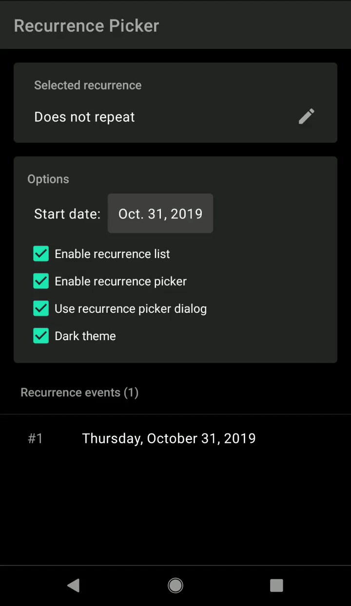

# Recurrence picker
Fully customizable recurrence picker dialog and fragment, compatible with API 19. 
Easy to set up and to customize, almost every view can be styled with attributes. 
Several settings are available to change the picker interface and behavior.

  

#### Gradle dependency
`implementation 'com.maltaisn:recurpicker:X.Y.Z'`

Replace `X.Y.Z` with lastest version number: 

If you haven't migrated to AndroidX, use version 1.4.5. 
Version 1.5.0 and above use AndroidX.
Version 2.0.0 and above are written in Kotlin but should support Java well.

## Documentation
All documentation is on the [wiki](https://github.com/maltaisn/recurpickerlib/wiki)

## Changelog
View [changelog](CHANGELOG.md).

## Credits
- Thanks to [David Vavra](https://github.com/davidvavra) and his translators for translating to 10 languages.
- Thanks to [bezysoftware](https://github.com/bezysoftware) for translating to 5 languages.

## Translations
The library is available in 17 languages. If you make a translation please send a pull request! 
There are comments in the default strings.xml to help with specific translation requirements.
Note that v2 introduced some strings and current translations may not be 100% accurate.
