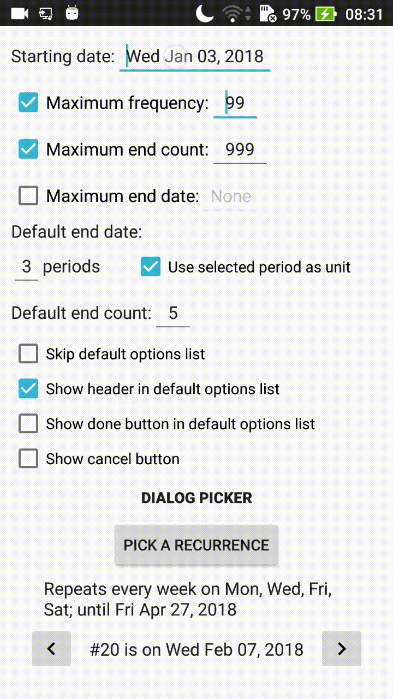

# Recurrence picker
Fully customizable recurrence view and dialog, compatible with API 21. Easy to set up and to customize, almost every view can be styled with attributes. Several settings are available to change the picker interface.

### Gradle dependency
`compile 'com.maltaisn.recurpickerlib:recurpicker:1.0'`

## Tutorial
- **Get started with [using the recurrence picker dialog](https://github.com/maltaisn/recurpickerlib/wiki/Using-the-dialog-picker) or the [recurrence picker view](https://github.com/maltaisn/recurpickerlib/wiki/Using-the-picker-view) by itself.**
- Customize the picker appearance and behaviour by [changing its settings](https://github.com/maltaisn/recurpickerlib/wiki/Recurrence-picker-settings)
- Learn how to [style the view](https://github.com/maltaisn/recurpickerlib/wiki/Styling-the-view) with the attributes
- [Create or edit recurrence objects](https://github.com/maltaisn/recurpickerlib/wiki/Creating-or-editing-a-recurrence) by yourself

## Screenshots

